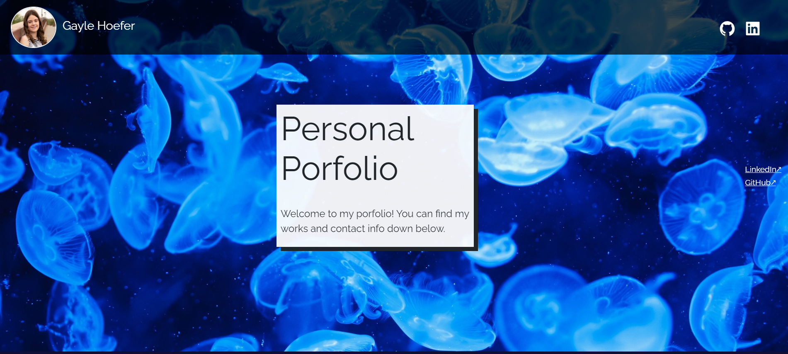

# Gayle Hoefer's Portfolio



## Table of Contents  
* [Description](##Description)  
* [Technologies](##Technologies)  
* [Screenshot](##Screenshot)  
* [Installation](##Installation)  
* [License](##License)  
* [Questions](##Questions)  

## Description

This react web application is a portfollio of Gayle Hoefer's work. It includes an about me, portfolio, resume, and contact me section. This web application is meant to allow future employers to see what work Gayle has completed. It is also in an easily sharable link so that it can be added to Gayle's resume.


### Future Development

This application will eventually host all my projects, but with pagination to avoid a cluttered screen.

## Deployed Application

The deployed application is at https://hoeferg.github.io/GaylePortfolio/

## Installation

1. Clone the repo
   ```sh
   git clone https://github.com/hoeferg/GaylePortfolio
   ```
2. Install NPM packages
   ```sh
   npm install
   ```
3. Start the application
   ```sh
   npm start


## License

No license

---

## Contact
Gayle Hoefer - [LinkedIn](https://www.linkedin.com/in/gayle-hoefer-61a2a3124/) - [Github](https://github.com/hoeferg)
